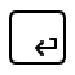

# Stolen-Mouse

Ce projet est réalisé dans le cadre de la Nuit de l'Info 2022.
Le but de ce projet est de créer un site web en intéragissant uniquement via le clavier.
Pour ce faire, nous allons associer des touches du clavier à des actions.

## Actions possibles

 : permet de passer de l'élément courant à l'élément du **dessus**

 : permet de passer de l'élément courant à l'élément du **dessous**

 : permet de passer de l'élément courant à l'élément de **gauche**

 : permet de passer de l'élément courant à l'élément de **droite**

 : permet d'accéder à l'élément **courant**

 : permet d'afficher l'aide

## Comment fonctionne le site ?

Le site est composé de plusieurs pages, chacune ayant un lien vers une autre page.
Chaque page est composée d'éléments, qui sont des liens vers une autre page.
Lorsque l'on appuie sur une touche, l'action associée est effectuée.

Par exemple, si l'on appuie sur la touche , l'élément courant passe à l'élément du dessous.

Notre algorithmique est la suivante :

1. Au démarage, on récupère la page courante
2. On liste tous les éléments interactifs de la page courante
3. On récupère l'élément courant, le plus en haut de la page
4. Lorsque l'utilisateur appuie sur une touche, on effectue l'action associée
5. La nouvelle page est chargée et on recommence à l'étape 1

## Informations complémentaires

Nous avons basé note site sur la fonctionnalité de navigation sans souris.

Le contenu du site est totalement arbitraire et n'a aucun but commercial.

Plusieurs extensions sont disponibles pour naviguer sans souris, comme [Vimium](https://vimium.github.io/), cependant nous avons choisi de ne pas utiliser d'extension pour ce projet et d'intégrer la solution directement dans le site.

## Screenshots du site
